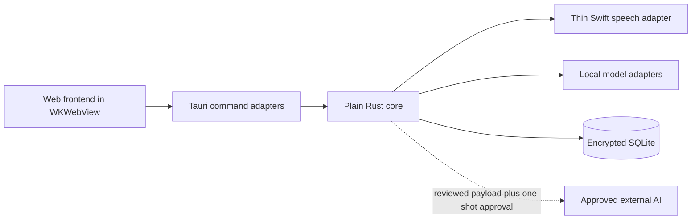

# Architecture

This is the authoritative index for cross-cutting system decisions. The
[preserved product brief](reference/local-clinical-ai-privacy-gateway-mvp.md)
is source material; this architecture and the feature intents supersede its
earlier paste-only roadmap.

## System boundary

The system is a personal macOS desktop application used by one clinician on one
Apple Silicon Mac. It has no accounts, synchronisation service, remote backend,
mobile client, or automatic clinical-content egress.

The frontend is untrusted with respect to system access. It reaches native
capabilities only through explicitly exposed Tauri commands. Domain behaviour
lives in the Rust core, which knows nothing about Tauri, Swift, or the chosen
web framework.

## First-release capability

- Paste text or dictate through the microphone.
- Transcribe locally after voice-activity detection.
- Detect direct and indirect identifiers using independent local passes.
- Apply consistent pseudonymisation, generalisation, and constrained cleanup.
- Require clinician review before saving or copying transformed text.
- Save reviewed notes, with temporary source audio, in one encrypted database.
- Search reviewed notes with encrypted FTS5 keyword search.
- Specify external AI egress, but keep it unavailable until a concrete use case
  and information-governance approval exist.

Client profiles, preset privacy modes, workflow prompt templates, reflective
practice analysis, semantic search, mobile support, synchronisation, multi-user
access, autonomous clinical decisions, and cloud processing are later concerns.

## Component responsibilities

| Component | Responsibility |
| --- | --- |
| Web frontend | Capture interaction, render diffs and detections, collect explicit decisions |
| Tauri adapter | Narrow commands, capability enforcement, event/stream translation |
| Rust core | Sessions, detection orchestration, transformations, review state, retention and egress policy |
| Swift adapter | SpeechAnalyzer/SpeechDetector invocation and timestamped transcript results only |
| Model adapters | Embedded NER, local contextual privacy sweep, and constrained cleanup |
| SQLite adapter | SQLCipher connections, migrations, note/audio persistence, FTS5 |
| Egress adapter | Disabled-by-default submission of one approved payload to one configured destination |

## Conceptual contracts

These are stable domain shapes, not committed Rust or IPC schemas:

- A **transcript segment** carries text, an audio time range, and provisional or
  final status.
- A **detection** carries a stable ID, span or contextual evidence, category and
  subtype, confidence, contributing stages, rationale, proposed replacement,
  and review state.
- A **review decision** is accept, edit, keep, or remove. It is distinct from
  saving the note and from egress approval.
- A **reviewed note** contains the clinician-approved text, encrypted detection
  provenance, timestamps, and optional temporary audio alignment.
- An **egress approval** binds the exact reviewed revision and payload to one
  destination, purpose, and attempted submission. It cannot be reused.

## Decision index

| Area | Decision | Status |
| --- | --- | --- |
| Desktop shell | Tauri 2.11 line with WKWebView; initial Clinician’s Veil welcome shell | Decided |
| Core | Plain Rust library behind adapters | Decided |
| Persistence | `rusqlite`, bundled SQLCipher, FTS5 | Decided; combined build spike required |
| Speech | SpeechAnalyzer first; benchmark against WhisperKit | Benchmark gate |
| Detection | Embedded Rust rules and token-classification model; no Python sidecar | Decided; model selection open |
| Local LLM | Llama 3.2 1B, sequentially loaded, for privacy sweep and cleanup | Benchmark gate |
| Search | FTS5/BM25 in the first release | Decided |
| Semantic search | `sqlite-vec` integration seam only | Deferred |
| Audio retention | Encrypted source audio and aligned transcript for 30 days | Decided |
| External AI | Designed now, unavailable pending use case and governance approval | Gated |
| Frontend framework | Vite/TypeScript for the initial shell; command boundary remains enforced | Decided |
| Distribution | GitHub Actions validates PRs; matching version tags release an unsigned arm64 DMG | Decided |

## Focused architecture

- [Privacy and security](architecture/privacy-security.md)
- [Processing pipeline](architecture/processing-pipeline.md)
- [Storage and search](architecture/storage-search.md)
- [Native integration](architecture/native-integration.md)
