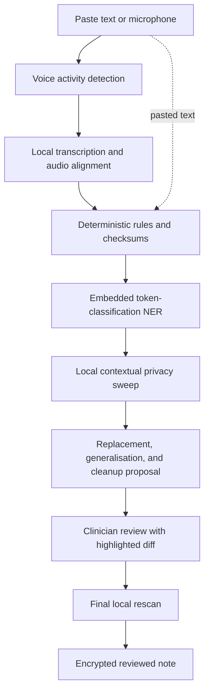

# Processing Pipeline

## Flow

Pasted text joins the pipeline at deterministic detection. Microphone audio is
gated by voice activity before ASR so silence is not offered to the transcriber.
Source audio and final transcript segments share timestamps for later checking.

## Detection stages

1. **Deterministic rules** detect structured identifiers, including validated
   NHS numbers, postcodes, NI numbers, phone numbers, email addresses, URLs,
   dates, IDs, case references, and file paths. Checksums and contextual
   invalidation take precedence over loose regex matching.
2. **Embedded NER** detects people, places, organisations, facilities, and
   relationships through a Rust-compatible token-classification runtime.
   Presidio's recogniser concepts inform the design, but Presidio itself is a
   Python service and is not bundled. See the
   [Presidio Analyzer architecture](https://microsoft.github.io/presidio/analyzer/).
3. **Contextual privacy sweep** uses the local 1B model to flag identifying
   combinations and free-text leakage that token detection misses. It emits
   warnings and evidence, not legal conclusions.
4. **Final rescan** reruns applicable deterministic and model checks over the
   clinician-edited result before it can be treated as reviewed.

Stages contribute to the same detection rather than creating duplicate review
items. Overlapping spans resolve into the most privacy-protective proposal while
preserving every contributing stage in encrypted provenance.

Recall is preferred over precision. Uncertainty creates a review item; it does
not silently discard text.

## Transformation and cleanup

Transformations preserve clinical meaning through role labels such as
`[CLIENT]`, `[MOTHER]`, `[CASE_MANAGER]`, and `[COLLEGE]`, plus clinically useful
generalisations for dates, ages, locations, organisations, occupations, and
unusual circumstances. Repeated aliases resolve consistently within a note.

The local LLM may propose tightly constrained grammar and clarity cleanup after
privacy detection. The UI displays its changes as a diff. Cleanup cannot invent
clinical facts, alter numbers or negation without a specific warning, or bypass
item-level editing and final review.

## Model lifecycle and memory

The M2 Mac's 8 GB unified memory is the binding constraint. Load one major model
stage at a time and release its resources when the stage completes or is
cancelled. SpeechAnalyzer operates in system-managed memory; embedded NER and
the local LLM must not remain resident together without measured evidence.

Apple documents SpeechAnalyzer as on-device, with model assets outside the
application's bundle and runtime memory allocation. See
[Apple's SpeechAnalyzer session](https://developer.apple.com/videos/play/wwdc2025/277/).

## Selection gates

- Start with SpeechAnalyzer and SpeechDetector. Benchmark it against WhisperKit
  on 30–60 minutes of non-patient dictation before fixing the ASR engine.
- Weight drug names, dosages, numbers, abbreviations, and negations more heavily
  than aggregate word-error rate.
- Select the embedded NER model and runtime using the synthetic privacy corpus;
  a small token classifier is the required shape, not a preselected package.
- Measure the Llama 3.2 1B privacy sweep and cleanup separately. A stage remains
  only if it improves its own acceptance metrics within the memory budget.
