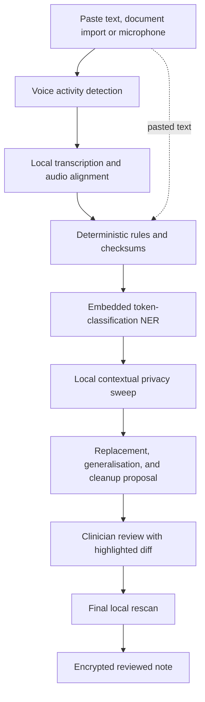

# Processing Pipeline

## Flow

```mermaid
flowchart TD
    INPUT[Paste text, document import or microphone]
    VAD[Voice activity detection]
    ASR[Local transcription and audio alignment]
    RULES[Deterministic rules and checksums]
    NER[Embedded token-classification NER]
    SWEEP[Local contextual privacy sweep]
    TRANSFORM[Replacement, generalisation, and cleanup proposal]
    REVIEW[Clinician review with highlighted diff]
    CHECK[Final local rescan]
    STORE[Encrypted reviewed note]

    INPUT --> VAD --> ASR --> RULES --> NER --> SWEEP --> TRANSFORM --> REVIEW --> CHECK --> STORE
    INPUT -. pasted text .-> RULES
```

Pasted text and clinician-checked document extractions join the pipeline at
deterministic detection, with a 100,000-Unicode-character source limit.
Document extraction does not bypass saved-redaction controls or final review. Microphone audio is
gated by voice activity before ASR so silence is not offered to the transcriber.
Source audio and final transcript segments share timestamps for later checking.

## Detection stages

### Initial text-only slice

The [in-memory text review](../../specs/text-review/intent.md) currently implements
rules → embedded NER → placeholder proposals → review → final rules/NER rescan.
It does not yet implement the contextual Llama sweep or cleanup shown in the
full pipeline above. Dictation and storage are described below and in
[storage and search](storage-search.md).

The evaluated baseline is the quantised ONNX export of `dslim/bert-base-NER` from
`onnx-community/bert-base-NER-ONNX`, pinned at
`9faa2f4a2d59b396888b318f596ff719cc893f1e`, running through `ort` 2.0.0-rc.12
(ONNX Runtime 1.24.2). This fills the previously open token-classifier slot; it
does not replace Llama 3.2 1B. English news-domain training is a limitation, not
evidence of clinical coverage. See the [evaluation and known gaps](../evaluation/text-review.md).

Encode the complete bounded source before explicitly constructing overlapping
windows (510 content tokens, 64-token overlap, plus BERT special tokens).
Tokenizer-level early truncation must not silently omit later text. Partial
subword detections expand to word boundaries before overlap merging.

Exact phrase/category grouping is explicit and splittable, with no fuzzy alias
or relationship inference. A clinician may explicitly save an accepted or edited
exact phrase/category mapping for all patients or the selected patient. Both
case-insensitively detect later whole-phrase occurrences, with the patient
mapping taking precedence. A saved mapping is accepted automatically on a new
note, unless the per-note **Review saved redactions** control leaves library
matches pending.
Placeholder labels are constrained to bracketed ASCII
labels; free-form generated prose is not accepted. Final rescans mask generated
placeholder spans using length-preserving spaces and map new detections back
to source positions. Model handles are dropped after every run, including errors
and cancellation; there is no resident inference service.

### Dictation slice

Push-to-talk [dictation](../../specs/capture-and-transcription/intent.md) runs
microphone → 16 kHz resampling → Silero voice activity → utterance segmentation
→ Whisper → transcript clean-up → insertion into the focused field. An
utterance starts after 250 ms of speech (with 300 ms pre-roll), ends after
700 ms of silence, and is split at its quietest recent frame before Whisper's
30-second window. The open utterance is re-transcribed about every 1.2 s for
provisional text, which the UI shows only as “Not yet final”; only final text
is inserted. The segmenter drops everything on cancel, and a recording is bounded
to 10 minutes. The inserted text is ordinary source text: it joins the text-only
slice at deterministic detection like typed text. Audio alignment and replay are
not implemented.

### Full first-release pipeline

1. **Deterministic rules** detect structured identifiers, including validated
   NHS numbers, labelled NHS-shaped values, address leads, postcodes, NI
   numbers, phone numbers, email addresses, URLs,
   dates, IDs, case references, and file paths. Checksums and contextual
   invalidation take precedence over loose regex matching.
2. **Embedded NER** detects people, places, organisations, facilities, and
   relationships through a Rust-compatible token-classification runtime.
   Presidio's recogniser concepts inform the design, but Presidio itself is a
   Python service and is not bundled. See the
   [Presidio Analyzer architecture](https://microsoft.github.io/presidio/analyzer/).
3. **Contextual privacy sweep** uses the local 1B model to flag identifying
   combinations and free-text leakage that token detection misses. It emits
   warnings and evidence, not legal conclusions.
4. **Final rescan** reruns applicable deterministic and model checks over the
   clinician-edited result before it can be treated as reviewed.

Stages contribute to the same detection rather than creating duplicate review
items. Overlapping spans resolve into the most privacy-protective proposal while
preserving every contributing stage in encrypted provenance.

Recall is preferred over precision. Uncertainty creates a review item; it does
not silently discard text.

## Transformation and cleanup

Transformations preserve clinical meaning through role labels such as
`[CLIENT]`, `[MOTHER]`, `[CASE_MANAGER]`, and `[COLLEGE]`, plus clinically useful
generalisations for dates, ages, locations, organisations, occupations, and
unusual circumstances. Repeated aliases resolve consistently within a note.

The local LLM may propose tightly constrained grammar and clarity cleanup after
privacy detection. The UI displays its changes as a diff. Cleanup cannot invent
clinical facts, alter numbers or negation without a specific warning, or bypass
item-level editing and final review.

## Model lifecycle and memory

The M2 Mac's 8 GB unified memory is the binding constraint. Load one major model
stage at a time and release its resources when the stage completes or is
cancelled. Embedded NER and the local LLM must not remain resident together
without measured evidence.

Whisper large-v3 turbo (q5_0) measured about 0.8 GB resident on an M4 Pro
development Mac; the target M2 figure is pending. It loads when a recording
starts, while capture already buffers audio, stays resident for 90 seconds
after the recording ends so consecutive dictations start quickly, and is dropped
before any NER run. Detection is refused while a recording is active, so
Whisper and the NER model are never resident together.

## Selection gates

- Whisper large-v3 turbo (q5_0) is the initial engine. Benchmark it against the
  pinned small.en (q5_1) fallback on 30–60 minutes of non-patient dictation on the
  target M2 before fixing the ASR model, and fall back if finalising a 10-second
  utterance takes more than about 1.5 s or memory does not fit alongside the app.
  `crates/local-asr/examples/benchmark.rs` reports load time and per-utterance
  latency for synthetic audio. On an M4 Pro, a pass took 0.65–0.77 s regardless
  of length, because Whisper encodes a fixed 30-second window.
- Weight drug names, dosages, numbers, abbreviations, and negations more heavily
  than aggregate word-error rate.
- Select the embedded NER model and runtime using the synthetic privacy corpus;
  a small token classifier is the required shape, not a preselected package.
- Measure the Llama 3.2 1B privacy sweep and cleanup separately. A stage remains
  only if it improves its own acceptance metrics within the memory budget.
