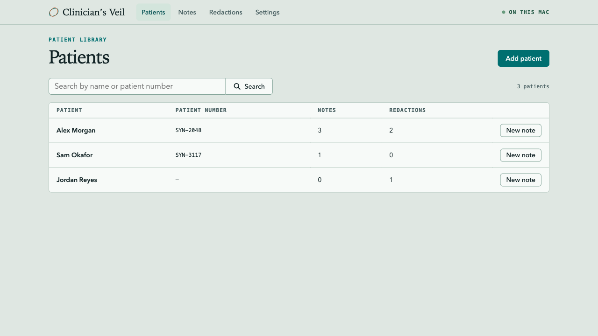
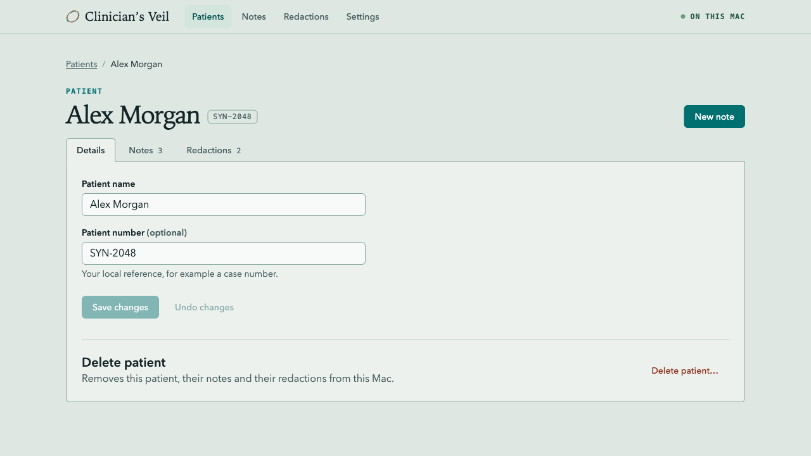
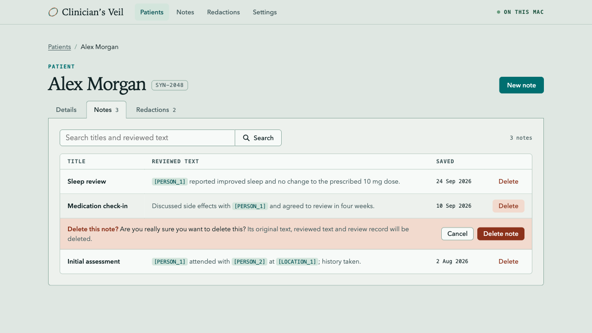
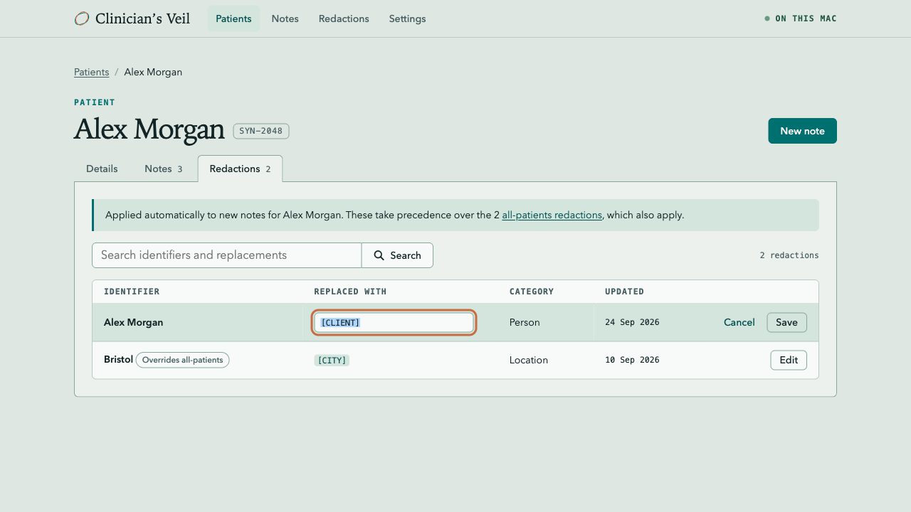
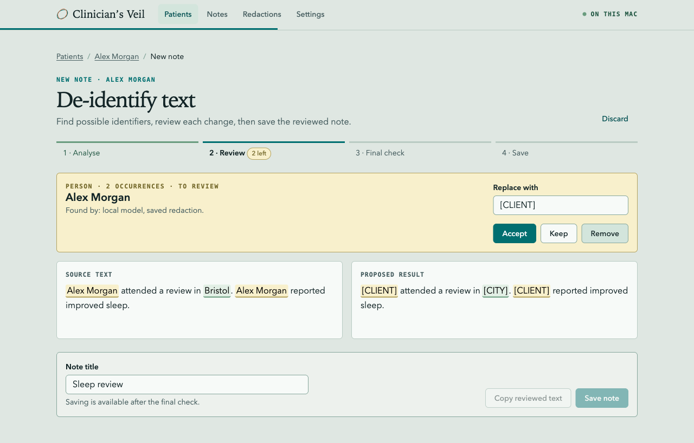

# Design System

**Status:** Accepted. Step 1 of the [delivery plan](#delivery-plan) is
implemented. The welcome page is the reference and does not change.

This document defines how Clinician’s Veil looks and how the clinician moves
through it. It covers information architecture, tokens, components, and copy.
Use the canonical language in [CONTEXT.md](../CONTEXT.md).

## Principles

1. **The patient is the centre.** Every note and patient redaction belongs to a
   patient. The clinician opens a patient, then works inside that patient.
2. **One level of navigation, one level of tabs.** The app header holds the
   global destinations. A patient has three tabs. Nothing nests deeper.
3. **No modals or overlays.** Every task happens in the page: create and edit
   forms are pages or tab panels, confirmations expand inline, and progress
   appears in the header activity bar. The selection menu in the review
   workspace is the one anchored floating element. The About dialog on the
   welcome page stays as it is.
4. **Every collection has two scopes: all patients, and one patient.** Notes and
   redactions use the same table component at both scopes. The patient scope
   drops the Patient column and adds nothing new to learn.
5. **One primary action per view.** Only one teal button appears on screen at a
   time. Everything else is secondary, quiet, or destructive.
6. **State is always text as well as colour.** Pending (yellow) and decided
   (green) always come with a label. Green describes a decision, not a privacy
   guarantee.
7. **Local by default, visibly.** “On this Mac” stays in the header on every
   screen after the welcome page.

## Information architecture

```text
Welcome (unchanged)
  ├─ New note  → Patients (choose one)
  ├─ Patients
  └─ Notes

App header: [mark] Clinician’s Veil   Patients  Notes  Redactions  Settings   ● On this Mac

Patients                      /patients             searchable table
  New patient                 /patients/new         page form
  Patient                     /patients/:id         ribbon + tabs
    Details                   …/details             editable form, delete patient
    Notes                     …/notes  (default)    searchable table
    Redactions                …/redactions          patient redactions table
    New note / open note      …/notes/new, …/notes/:noteId   review workspace
Notes (all patients)          /notes                searchable table with Patient column
Redactions (all patients)     /redactions           global redactions table
Settings                      /settings             local model
```

The breadcrumb shows the path above the page title, for example
`Patients / Alex Morgan / New note`. The mark in the header returns to the
welcome page. Opening a note from the all-patients Notes table goes to that
note inside its patient, so the breadcrumb always leads back to the patient.

### Redactions at two scopes

- **All-patients redactions** apply to new notes for every patient.
- **Patient redactions** apply to new notes for one patient and take precedence
  over an all-patients redaction for the same phrase and category. The row shows
  an **Overrides all-patients** badge.
- The patient Redactions tab links to the all-patients list so the clinician can
  see everything that applies.
- Redactions are created only while reviewing a note, by choosing to save a
  replacement. The Redactions screens never add or delete them.
- The only change on a Redactions screen is **Edit**, which changes the
  replacement text. The identifier, category, and scope stay fixed because they
  decide what the redaction matches. A patient's redactions are removed only
  when the patient is deleted.
- **Review saved redactions** remains the per-note opt-out before analysis.

### What changes from today

| Today                                               | Proposed                                                  |
| --------------------------------------------------- | --------------------------------------------------------- |
| Flat nav: Home, Patients, Notes, Mappings, Settings | Header nav plus breadcrumb; patient workspace with tabs   |
| Patients table only starts notes or deletes         | Row opens the patient; **New note** stays as a row action |
| Patient name and number cannot be edited            | **Details** tab edits them in place                       |
| One Notes table across all patients                 | Patient **Notes** tab; all-patients Notes table remains   |
| Mappings page mixes global and current patient      | **Redactions** tab (patient) and Redactions page (global) |
| Add patient, save note, and delete use `<dialog>`   | Page form, inline save bar, and inline confirmation       |
| Full-screen operation overlay                       | Header activity bar; page content is `inert` while busy   |

## Tokens

Tokens are CSS custom properties in `src/styles/tokens.css`. Components use
only tokens. A raw hex, radius, or font size in a component stylesheet is a
defect. The welcome page and About dialog use tokens where one matches and
keep their bespoke display sizes and two secondary-button colours. Today the stylesheets use 40 distinct colours, 9 radii, and 24 font sizes;
the target is the set below.

### Colour

| Token                    | Value     | Use                                           |
| ------------------------ | --------- | --------------------------------------------- |
| `--color-paper`          | `#dfe7e2` | App background (the welcome page paper)       |
| `--color-surface`        | `#edf1ed` | Tab panels, save bar, settings sections       |
| `--color-surface-raised` | `#f7faf8` | Inputs, tables, text panes, secondary buttons |
| `--color-line`           | `#b9cbc3` | Table rules, header rule                      |
| `--color-line-strong`    | `#87a79c` | Control borders, tab outline                  |
| `--color-ink`            | `#122426` | Text                                          |
| `--color-ink-muted`      | `#496062` | Secondary text, table headings                |
| `--color-accent`         | `#006f70` | Primary button, eyebrow, current step         |
| `--color-accent-strong`  | `#004e50` | Primary hover, links                          |
| `--color-accent-soft`    | `#d3e5dc` | Current nav item, hover, placeholder chips    |
| `--color-signal`         | `#c86c42` | Focus ring and the active review highlight    |
| `--color-pending`        | `#f8f0cc` | Needs a decision (with `-line`/`-ink`)        |
| `--color-decided`        | `#e2efe5` | Decision made (with `-line`/`-ink`)           |
| `--color-danger`         | `#8c321b` | Destructive buttons and text                  |
| `--color-danger-soft`    | `#f2dace` | Inline confirmation background                |

The pending set is `#f8f0cc` / `#b3a25e` / `#776c2f`, and the decided set is
`#e2efe5` / `#699c7e` / `#235844`. Signal is not used for text or errors;
errors use danger.

### Typography

| Role    | Family                              | Use                                                                        |
| ------- | ----------------------------------- | -------------------------------------------------------------------------- |
| Display | Iowan Old Style, Palatino, serif    | One page title per screen (patient name, “Patients”) and the brand         |
| Body    | Avenir Next, Avenir, Helvetica Neue | Everything else, including section headings (600 weight)                   |
| Utility | SF Mono, Menlo                      | Eyebrows, table headings, dates, counts, patient numbers, `[PLACEHOLDERS]` |

Scale: `--text-xs` 0.72rem, `--text-sm` 0.875rem, `--text-md` 1rem,
`--text-lg` 1.25rem, `--text-xl` 2.5rem. The welcome page keeps its own
display size. Section headings stop using the serif; only the page title
uses it.

### Space, shape, and layout

- Spacing uses a 4 px base: `--space-1` 4, `-2` 8, `-3` 12, `-4` 16, `-6` 24,
  `-8` 32, `-12` 48.
- One radius, `--radius` 6 px, applies to controls and surfaces. `--radius-pill`
  is only for badges.
- Controls are `--control-height` 36 px. Table-row actions use
  `--control-height-compact` 28 px.
- No shadows. Surfaces are separated by borders and the paper/surface step.
  `--shadow-float` is reserved for the anchored selection menu; the existing
  dialogs and operation overlay use it until step 5 removes them.
- Content is centred at `--content-width` 1120 px with 24 px gutters.
- Focus is `3px solid var(--color-signal)` with a 2 px offset everywhere.

## Components

| Component              | Rules                                                                                                                                                                                                                                                |
| ---------------------- | ---------------------------------------------------------------------------------------------------------------------------------------------------------------------------------------------------------------------------------------------------- |
| App header             | Sticky. Mark + name (to welcome), four nav links with `aria-current="page"`, local indicator.                                                                                                                                                        |
| Activity bar           | 3 px bar under the header. Determinate when progress is known. Status text and **Cancel** go in the page header.                                                                                                                                     |
| Breadcrumb             | `<ol>` in a `<nav aria-label="Breadcrumb">`; last item has `aria-current="page"`.                                                                                                                                                                    |
| Page header            | Eyebrow, display title, optional one-line description, actions on the right.                                                                                                                                                                         |
| Patient ribbon         | Page header with the patient name, patient number chip, **New note**, and tabs sitting on its bottom rule.                                                                                                                                           |
| Tabs                   | `role="tablist"`. Each tab is a link to its own route so back/forward works. Counts in utility type.                                                                                                                                                 |
| Button                 | Intents: primary, secondary (default), quiet, danger, danger-quiet. Sizes: default and compact.                                                                                                                                                      |
| Field                  | Label above, optional hint and error below. Errors use `aria-invalid` and `aria-describedby`.                                                                                                                                                        |
| Search                 | Above its table: input joined to a **Search** button with a magnifying-glass icon. Enter or the button runs it. The button is secondary, so the page keeps one primary action. A status line shows the match count, the query, and **Clear search**. |
| Data table             | Mono uppercase headings. The whole row opens the item. The actions column is right-aligned; delete is danger-quiet.                                                                                                                                  |
| Inline confirmation    | Replaces the row (tables) or the danger zone (Details) with the question, consequence, **Cancel**, and a danger button. Focus moves to **Cancel**.                                                                                                   |
| Inline edit row        | **Edit** turns the replacement cell into an input, focused with its text selected. **Save** is secondary and **Cancel** is quiet. **Escape** cancels and returns focus to **Edit**.                                                                  |
| Save bar               | Bottom of the review workspace: note title field, **Copy reviewed text**, **Save note**.                                                                                                                                                             |
| Notice                 | Info (accent) or danger. Used for scope explanations and page-level errors (`role="alert"`).                                                                                                                                                         |
| Badge                  | Neutral, pending, or decided. Always text.                                                                                                                                                                                                           |
| Empty state            | Dashed outline, one sentence of direction, and the action that fills it.                                                                                                                                                                             |
| Review marks and cards | Existing review behaviour, restyled to tokens: pending yellow and decided green, with labels.                                                                                                                                                        |

### Screens

```text
Patients                                        Patient · Notes tab
┌──────────────────────────────────────────┐    ┌──────────────────────────────────────────┐
│ PATIENT LIBRARY                          │    │ Patients / Alex Morgan                   │
│ Patients                  [Add patient]  │    │ PATIENT                                  │
│ [Search name or number ][⌕ Search] 3     │    │ Alex Morgan [SYN-2048]       [New note]  │
│ PATIENT      NUMBER    NOTES  REDACTIONS │    │ ┌Details┐┌Notes 3┐┌Redactions 2┐         │
│ Alex Morgan  SYN-2048  3      2  [New note]   │ ├─────────────────────────────────────────┤
│ Sam Okafor   SYN-3117  1      0  [New note]   │ │ [Search titles ][⌕ Search]  3 notes    │
└──────────────────────────────────────────┘    │ │ TITLE     REVIEWED TEXT   SAVED        │
                                                │ │ Sleep …   [PERSON_1] …    24 Sep Delete│
Patient · Details tab                           │ │ ▌Delete this note? … [Cancel][Delete]  │
┌──────────────────────────────────────────┐    └──────────────────────────────────────────┘
│ Patient name   [Alex Morgan        ]     │
│ Patient number [SYN-2048           ]     │    Review workspace
│ [Save changes] Undo changes              │    ┌──────────────────────────────────────────┐
│ ──────────────────────────────────────── │    │ Patients / Alex Morgan / New note        │
│ Delete patient              Delete…      │    │ De-identify text               Discard   │
└──────────────────────────────────────────┘    │ Analyse ✓  Review ●  Final check  Save   │
                                                │ ┌ focused review card (pending) ───────┐ │
                                                │ │ Source text      │ Proposed result   │ │
                                                │ Title [          ] [Copy] [Save note]    │
                                                └──────────────────────────────────────────┘
```

Screenshots from a static prototype use synthetic content only:







## Decisions

- **Redactions** is the interface name for reusable identifier replacements at
  both scopes. [CONTEXT.md](../CONTEXT.md) defines it as a **saved redaction**,
  distinct from a one-off redaction decision.
- Redactions are created only during note review and are never deleted from the
  Redactions screens. The clinician can edit the replacement text. A mistaken
  redaction keeps applying until it is edited or the clinician chooses
  **Review saved redactions** for a note.
- Deletion of a patient or note uses the inline confirmation with the same
  wording as today’s modal. Step 5 updates the note-library intent.
- The all-patients Notes page stays, because the welcome page links to it.
- The About dialog is the one modal and stays on the welcome page.

## Copy

- Sentence case. Buttons name the outcome: **Save changes**, **Delete note**,
  **Save note**. The status that follows repeats the verb: “Changes saved.”
- One name per thing. Use **patient number** and **redaction** everywhere.
  **Note title** is not “reference”.
- Errors say what happened and what to do next. They never contain clinical text.
- Deletion asks, “Are you really sure you want to delete this?” and states the
  consequence underneath.
- Never describe output as safe, anonymous, or compliant.

## Accessibility floor

- Everything works by keyboard. Tabs, table rows, and inline confirmations have
  visible focus.
- When a view changes, focus moves to its `<h1>`. When an inline confirmation
  opens, focus moves to **Cancel**, and **Escape** closes it and restores focus.
- While an operation runs, page content is `inert` and the activity status is
  announced with `role="status"`.
- Text contrast meets WCAG AA on paper and surface. Colour never carries state
  alone.
- Reduced motion is respected. The only motion is the welcome mark and the
  activity bar.

## Delivery plan

Each step is a focused pull request with its own tests.

1. **Tokens.** _Done._ Add `tokens.css` and move `app.css` and `review.css`
   onto it without behaviour changes. Component classes arrive with the markup
   that uses them in steps 2–4.
2. **Shell and routing.** Add the app header, breadcrumb, and hash routes, and
   split `src/privacy/page.ts` into a router and one module per view. Keep the
   review workspace logic intact.
3. **Patient workspace.** Add the patient ribbon, tabs, Details form, and patient
   Notes table. This needs an `update_patient` command and a `patientId` filter
   on `search_notes`.
4. **Redactions.** Rename mappings to redactions in the interface, and add the
   patient Redactions tab and the all-patients Redactions page with inline
   editing of the replacement only. Remove the create and delete controls, and
   drop the `create_*mapping` and `delete_*mapping` commands from the Tauri
   adapter. Note review keeps saving redactions through
   `save_mapping_from_review`.
5. **No overlays.** Replace the add-patient, save-note, and deletion dialogs
   and the operation overlay, and remove `window.confirm`. Update
   `specs/encrypted-note-library/intent.md` and `specs/text-review/intent.md`
   in the same change.
